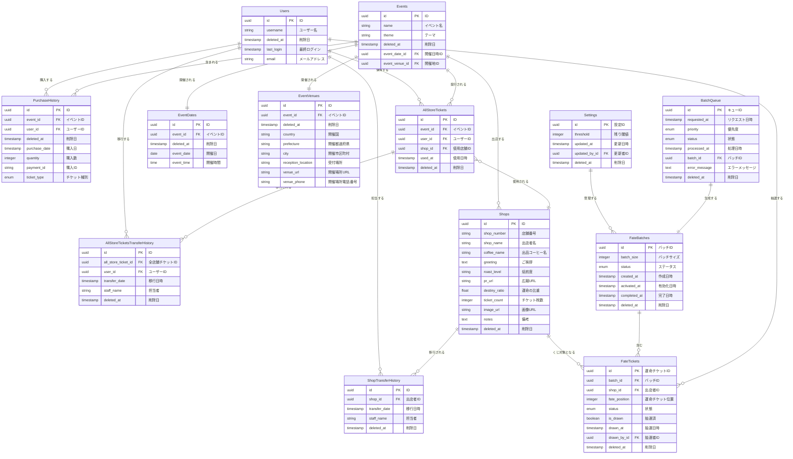

```mermaid
erDiagram
    Users ||--o{ PurchaseHistory : "購入する"
    Users ||--o{ AllStoreTickets : "保有する"
    Users ||--o{ AllStoreTicketsTransferHistory : "移行する"
    Users ||--o{ ShopTransferHistory : "担当する"
    
    Events ||--o{ PurchaseHistory : "含まれる"
    Events ||--|| EventDates : "開催される"
    Events ||--|| EventVenues : "開催される"
    Events ||--o{ AllStoreTickets : "発行される"
    Events ||--o{ Shops : "出店する"
    
    AllStoreTickets ||--o{ AllStoreTicketsTransferHistory : "移行される"
    AllStoreTickets }o--|| Shops : "使用される"
    
    Shops ||--o{ ShopTransferHistory : "移行される"
    
    Shops ||--o{ FateTickets : "くじ対象となる"
    FateBatches ||--o{ FateTickets : "含む"
    Users ||--o{ FateTickets : "抽選する"
    Settings ||--o{ FateBatches : "管理する"
    BatchQueue ||--|| FateBatches : "生成する"
    
    Users {
        uuid id PK "ID"
        string username "ユーザー名"
        timestamp deleted_at "削除日"
        timestamp last_login "最終ログイン"
        string email "メールアドレス"
    }
    
    PurchaseHistory {
        uuid id PK "ID"
        uuid event_id FK "イベントID"
        uuid user_id FK "ユーザーID"
        timestamp deleted_at "削除日"
        timestamp purchase_date "購入日"
        integer quantity "購入数"
        string payment_id "購入ID"
        enum ticket_type "チケット種別"
    }
    
    Events {
        uuid id PK "ID"
        string name "イベント名"
        string theme "テーマ"
        timestamp deleted_at "削除日"
        uuid event_date_id FK "開催日時ID"
        uuid event_venue_id FK "開催地ID"
    }
    
    EventDates {
        uuid id PK "ID"
        uuid event_id FK "イベントID"
        timestamp deleted_at "削除日"
        date event_date "開催日"
        time event_time "開催時間"
    }
    
    EventVenues {
        uuid id PK "ID"
        uuid event_id FK "イベントID"
        timestamp deleted_at "削除日"
        string country "開催国"
        string prefecture "開催都道府県"
        string city "開催市区町村"
        string reception_location "受付場所"
        string venue_url "開催場所URL"
        string venue_phone "開催場所電話番号"
    }
    
    AllStoreTickets {
        uuid id PK "ID"
        uuid event_id FK "イベントID"
        uuid user_id FK "ユーザーID"
        uuid shop_id FK "使用店舗ID"
        timestamp used_at "使用日時"
        timestamp deleted_at "削除日"
    }
    
    AllStoreTicketsTransferHistory {
        uuid id PK "ID"
        uuid all_store_ticket_id FK "全店舗チケットID"
        uuid user_id FK "ユーザーID"
        timestamp transfer_date "移行日時"
        string staff_name "担当者"
        timestamp deleted_at "削除日"
    }
    
    Shops {
        uuid id PK "ID"
        string shop_number "店舗番号"
        string shop_name "出店者名"
        string coffee_name "出品コーヒー名"
        text greeting "ご挨拶"
        string roast_level "焙煎度"
        string pr_url "広報URL"
        float destiny_ratio "運命の比重"
        integer ticket_count "チケット枚数"
        string image_url "画像URL"
        text notes "備考"
        timestamp deleted_at "削除日"
    }
    
    ShopTransferHistory {
        uuid id PK "ID"
        uuid shop_id FK "出店者ID"
        timestamp transfer_date "移行日時"
        string staff_name "担当者"
        timestamp deleted_at "削除日"
    }
    
    FateBatches {
        uuid id PK "バッチID"
        integer batch_size "バッチサイズ"
        enum status "ステータス"
        timestamp created_at "作成日時"
        timestamp activated_at "有効化日時"
        timestamp completed_at "完了日時"
        timestamp deleted_at "削除日"
    }
    
    FateTickets {
        uuid id PK "運命チケットID"
        uuid batch_id FK "バッチID"
        uuid shop_id FK "出店者ID"
        integer fate_position "運命チケット位置"
        enum status "状態"
        boolean is_drawn "抽選済"
        timestamp drawn_at "抽選日時"
        uuid drawn_by_id FK "抽選者ID"
        timestamp deleted_at "削除日"
    }
    
    Settings {
        uuid id PK "設定ID"
        integer threshold "残り閾値"
        timestamp updated_at "更新日時"
        uuid updated_by_id FK "更新者ID"
        timestamp deleted_at "削除日"
    }
    
    BatchQueue {
        uuid id PK "キューID"
        timestamp requested_at "リクエスト日時"
        enum priority "優先度"
        enum status "状態"
        timestamp processed_at "処理日時"
        uuid batch_id FK "バッチID"
        text error_message "エラーメッセージ"
        timestamp deleted_at "削除日"
    }
```