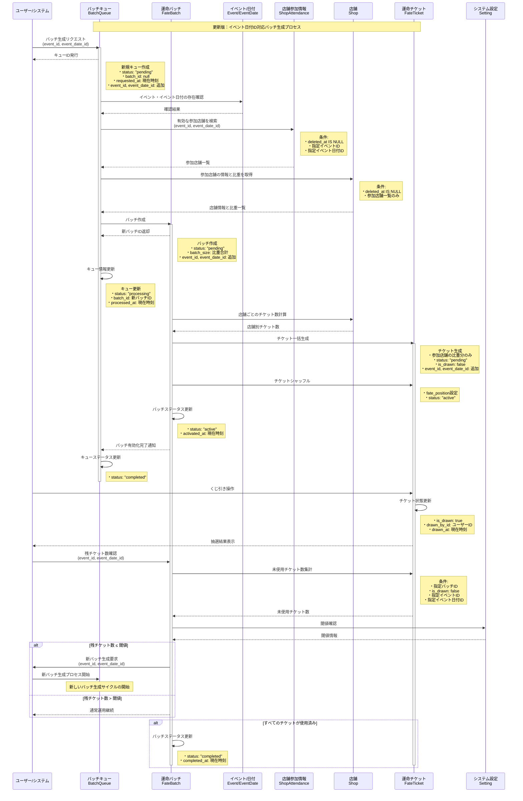

```mermaid
sequenceDiagram
    participant User as ユーザー/システム
    participant Queue as バッチキュー<br>BatchQueue
    participant Batch as 運命バッチ<br>FateBatch
    participant Event as イベント/日付<br>Event/EventDate
    participant Attendance as 店舗参加情報<br>ShopAttendance
    participant Shop as 店舗<br>Shop
    participant Ticket as 運命チケット<br>FateTicket
    participant Setting as システム設定<br>Setting
    
    Note over Queue,Ticket: 更新版：イベント日付ID対応バッチ生成プロセス
    
    %% バッチキュー作成フェーズ
    User->>Queue: バッチ生成リクエスト<br>(event_id, event_date_id)
    activate Queue
    Queue-->>User: キューID発行
    Note right of Queue: 新規キュー作成<br>・status: "pending"<br>・batch_id: null<br>・requested_at: 現在時刻<br>・event_id, event_date_id: 追加

    %% 参加店舗確認フェーズ（追加）
    Queue->>Event: イベント・イベント日付の存在確認
    Event-->>Queue: 確認結果
    Queue->>Attendance: 有効な参加店舗を検索<br>(event_id, event_date_id)
    Note right of Attendance: 条件:<br>・deleted_at IS NULL<br>・指定イベントID<br>・指定イベント日付ID
    Attendance-->>Queue: 参加店舗一覧
    
    %% バッチ作成フェーズ
    Queue->>Shop: 参加店舗の情報と比重を取得
    Note right of Shop: 条件:<br>・deleted_at IS NULL<br>・参加店舗一覧のみ
    Shop-->>Queue: 店舗情報と比重一覧
    Queue->>Batch: バッチ作成
    activate Batch
    Batch-->>Queue: 新バッチID返却
    Note right of Batch: バッチ作成<br>・status: "pending"<br>・batch_size: 比重合計<br>・event_id, event_date_id: 追加
    
    %% キュー更新フェーズ
    Queue->>Queue: キュー情報更新
    Note right of Queue: キュー更新<br>・status: "processing"<br>・batch_id: 新バッチID<br>・processed_at: 現在時刻
    
    %% チケット生成フェーズ
    Batch->>Shop: 店舗ごとのチケット数計算
    Shop-->>Batch: 店舗別チケット数
    Batch->>Ticket: チケット一括生成
    activate Ticket
    Note right of Ticket: チケット生成<br>・参加店舗の比重分のみ<br>・status: "pending"<br>・is_drawn: false<br>・event_id, event_date_id: 追加
    
    %% バッチ有効化フェーズ
    Batch->>Ticket: チケットシャッフル
    Note right of Ticket: ・fate_position設定<br>・status: "active"
    Batch->>Batch: バッチステータス更新
    Note right of Batch: ・status: "active"<br>・activated_at: 現在時刻
    
    %% キュー完了フェーズ
    Batch-->>Queue: バッチ有効化完了通知
    Queue->>Queue: キューステータス更新
    Note right of Queue: ・status: "completed"
    deactivate Queue
    
    %% 抽選フェーズ（ユーザー操作）
    User->>Ticket: くじ引き操作
    Ticket->>Ticket: チケット状態更新
    Note right of Ticket: ・is_drawn: true<br>・drawn_by_id: ユーザーID<br>・drawn_at: 現在時刻
    Ticket-->>User: 抽選結果表示
    
    %% チケット使用状況確認
    User->>Batch: 残チケット数確認<br>(event_id, event_date_id)
    Batch->>Ticket: 未使用チケット数集計
    Note right of Ticket: 条件:<br>・指定バッチID<br>・is_drawn: false<br>・指定イベントID<br>・指定イベント日付ID
    Ticket-->>Batch: 未使用チケット数
    
    %% 閾値チェックと次バッチ生成判断
    Batch->>Setting: 閾値確認
    Setting-->>Batch: 閾値情報
    
    alt 残チケット数 ≤ 閾値
        Batch->>User: 新バッチ生成要求<br>(event_id, event_date_id)
        User->>Queue: 新バッチ生成プロセス開始
        Note over Queue: 新しいバッチ生成サイクルの開始
    else 残チケット数 > 閾値
        Batch-->>User: 通常運用継続
    end
    
    %% バッチ完了フェーズ
    alt すべてのチケットが使用済み
        Batch->>Batch: バッチステータス更新
        Note right of Batch: ・status: "completed"<br>・completed_at: 現在時刻
        deactivate Batch
        deactivate Ticket
    end
```