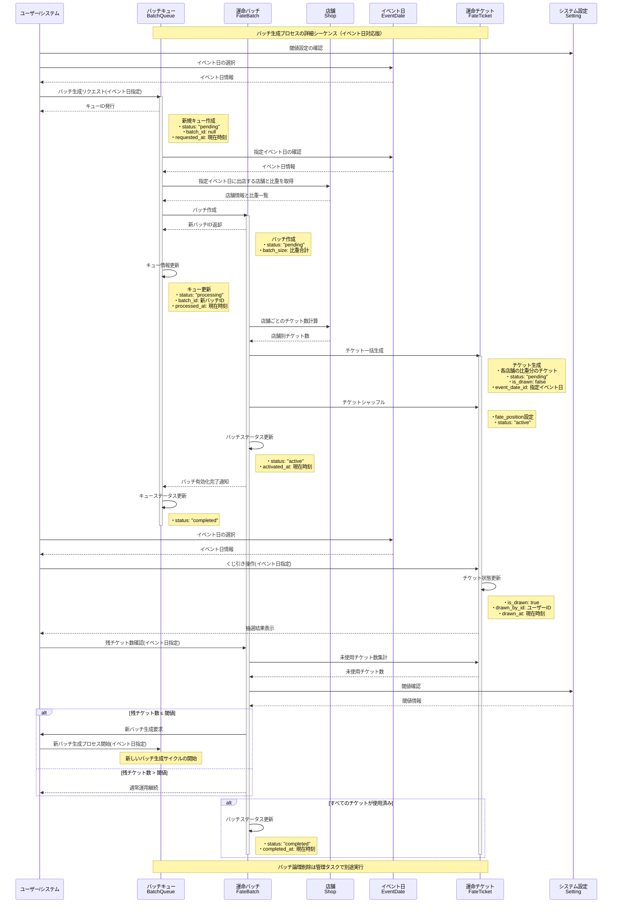

# 運命のチケットくじ引きロジック更新

イベント日ごとのくじ引き管理に対応するため、シーケンス図を更新しました。

## 主な変更点

1. **イベント日の選択ステップ追加**
   - バッチ生成リクエスト前にイベント日を選択するステップを追加
   - くじ引き操作時にもイベント日を指定するステップを追加

2. **イベント日に基づく店舗情報取得**
   - 指定されたイベント日に出店する店舗のみを対象に比重情報を取得

3. **チケット生成時のイベント日指定**
   - チケット生成時に`event_date_id`を設定

4. **イベント日ごとの残チケット確認**
   - 特定のイベント日に関連するチケットの残数を確認

## 実装上の注意点

- バッチ生成時には必ずイベント日を指定する必要があります
- 同じイベントでも日付ごとに異なるくじ引きバッチを管理できるようになります
- 既存のバッチ処理ロジックは、イベント日を考慮したものに更新する必要があります 